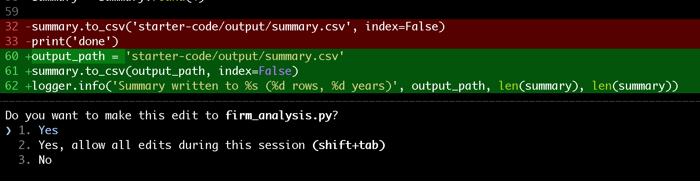

# Part 2, Step 2 – Add Logging

## Why Logging Matters on a Cluster

When you run a script interactively and it takes 10 seconds, `print('done')` is fine.

When you submit a job to a SLURM queue and it runs overnight, `print('done')` is useless. You want to know:

- When did each stage start and finish?
- How many rows were loaded? How many were filtered out?
- Did anything unexpected happen mid-run?

Python's built-in `logging` module solves this. It lets you:

- Set severity levels (`DEBUG`, `INFO`, `WARNING`, `ERROR`)
- Write logs to a file *and* stdout simultaneously
- Include timestamps automatically

---

## Your Prompt

:::{admonition} 💬 Prompt — Add logging
:class: tip
```
Modify starter-code/firm_analysis.py to use Python's logging module instead of
print statements. Requirements:
- Use logging.basicConfig to write logs to both stdout and a file called
  firm_analysis.log in the same directory as the script
- Log level INFO for normal progress messages (e.g., "Loaded 250 rows",
  "After filtering: 183 firms remain", "Summary written to ...")
- Log level DEBUG for detailed diagnostic information (e.g., column names,
  data types, shape before and after each operation)
- Include timestamps in the log format
- Replace the print('done') with a meaningful final log message
Do not change any of the calculations or the output file format.
```
:::

:::{note}
The AI should produce something like:

```python
import logging
import pandas as pd

logging.basicConfig(
    level=logging.DEBUG,
    format="%(asctime)s [%(levelname)s] %(message)s",
    handlers=[
        logging.FileHandler("firm_analysis.log"),
        logging.StreamHandler()
    ]
)
logger = logging.getLogger(__name__)

def main():
    logger.info("Loading firm data from starter-code/data/firms.csv")
    df = pd.read_csv('starter-code/data/firms.csv')
    logger.info(f"Loaded {len(df)} rows with columns: {list(df.columns)}")

    logger.debug("Computing financial metrics")
    df['profit'] = df['revenue'] - df['cost']
    df['profit_margin'] = df['profit'] / df['revenue']
    df['roa'] = df['profit'] / df['assets']
    df['asset_turnover'] = df['revenue'] / df['assets']

    pre_filter = len(df)
    df = df[df['revenue'] > 1000000]
    logger.info(f"Filtered to firms with revenue > $1M: {pre_filter} → {len(df)} rows")

    summary = df.groupby('year').agg(
        n_firms=('firm_id', 'count'),
        mean_profit_margin=('profit_margin', 'mean'),
        median_profit_margin=('profit_margin', 'median'),
        mean_roa=('roa', 'mean'),
        mean_asset_turnover=('asset_turnover', 'mean')
    ).reset_index()
    summary = summary.round(4)

    output_path = 'starter-code/output/summary.csv'
    summary.to_csv(output_path, index=False)
    logger.info(f"Summary written to {output_path} ({len(summary)} rows)")

if __name__ == "__main__":
    main()
```

Your version may differ in details. What matters is that `logging.basicConfig` is configured with both a `FileHandler` and a `StreamHandler`, and INFO messages report row counts and file paths.

Before applying changes, Claude will show you exactly which lines it intends to modify:


:::

---

## Run It and Read the Logs

```bash
python starter-code/firm_analysis.py
cat firm_analysis.log
```

You should see timestamped entries like:

```
2026-05-15 14:02:31 [INFO] Loading firm data from starter-code/data/firms.csv
2026-05-15 14:02:31 [INFO] Loaded 250 rows with columns: ['firm_id', 'year', ...]
2026-05-15 14:02:31 [INFO] Filtered to firms with revenue > $1M: 250 → 183 rows
2026-05-15 14:02:31 [INFO] Summary written to starter-code/output/summary.csv (5 rows)
```

:::{warning}
If the AI wrapped the main logic in an `if __name__ == '__main__':` block, great — that's correct Python style and important for testability in Step 3.

If it didn't, ask: *"Please wrap the main logic in an `if __name__ == '__main__':` block."*
:::

---

## Commit This Improvement

```bash
git add starter-code/firm_analysis.py
git commit -m "feat: replace print with structured logging (INFO + DEBUG)"
```

:::{important}
- [ ] Running the script produces timestamped log output on the terminal
- [ ] A `firm_analysis.log` file is created
- [ ] The `output/summary.csv` file is identical to before (same content)
- [ ] The change is committed to git
:::

---

**Next: [Step 3 – Add Unit Tests](step3-tests.md) →**
