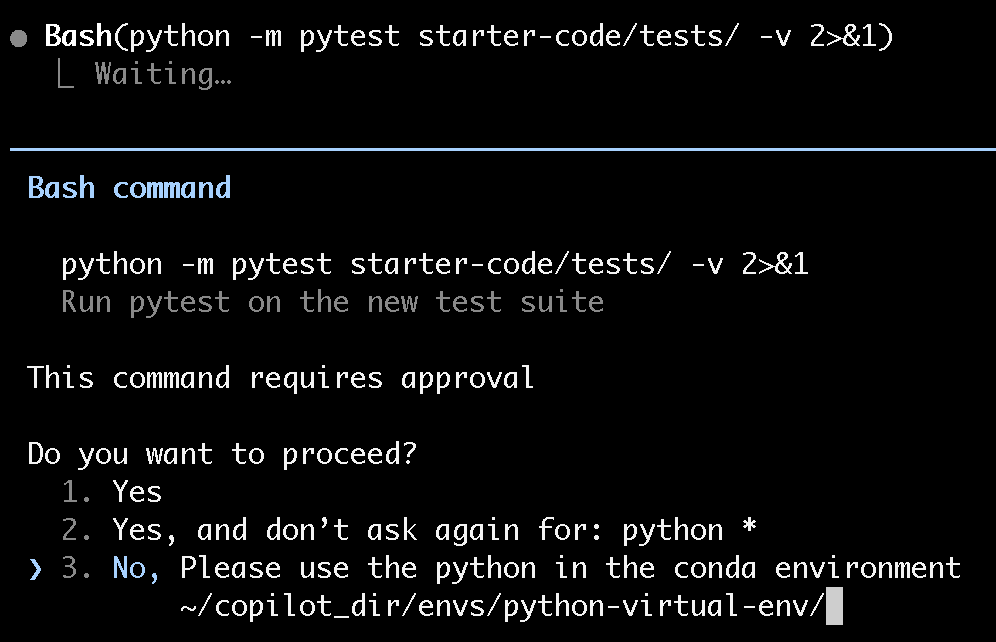
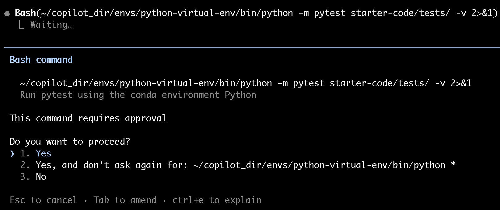

# Part 2, Step 3 – Add Unit Tests

## Why Tests Now, Before Translation?

We're about to ask the AI to translate this Python script to R. That translation might be subtly wrong — slightly different rounding, different handling of ties in a `median()`, different default behaviors.

**Unit tests are a contract.** If we write tests now that pass against the Python, we can run equivalent tests against the R translation and immediately see if the output diverges.

This is the key insight of this lab: **tests aren't just about catching bugs — they're about establishing ground truth before a change.**

---

## The Strategic Ask

You *could* ask: "Write tests for `firm_analysis.py`." But the script has no functions — it's one flat sequence of code. You can't import and call a function that doesn't exist.

So the ask has two parts: **refactor first, then test.**

:::{admonition} 💬 Prompt — Refactor into functions, then write tests
:class: tip
```
I need to add unit tests to starter-code/firm_analysis.py, but the logic is
all in one flat script with no functions. Please:

1. Refactor the calculation logic into pure functions:
   - compute_metrics(df): takes a DataFrame, returns it with profit, profit_margin,
     roa, and asset_turnover columns added
   - filter_firms(df, min_revenue): filters to firms above the revenue threshold
   - summarize_by_year(df): returns the grouped summary DataFrame

2. Keep the main() function calling these in order (don't change the behavior)

3. Write a pytest test file at starter-code/tests/test_firm_analysis.py that tests
   each function with a small DataFrame constructed inline (not by reading the CSV).
   Test at least:
   - compute_metrics returns correct profit_margin values
   - filter_firms correctly excludes firms below the threshold
   - summarize_by_year returns one row per year and correct n_firms counts
```
:::

:::{note}
**Refactored `firm_analysis.py`** will look something like:

```python
def compute_metrics(df):
    df = df.copy()
    df['profit'] = df['revenue'] - df['cost']
    df['profit_margin'] = df['profit'] / df['revenue']
    df['roa'] = df['profit'] / df['assets']
    df['asset_turnover'] = df['revenue'] / df['assets']
    return df

def filter_firms(df, min_revenue=1_000_000):
    return df[df['revenue'] > min_revenue].copy()

def summarize_by_year(df):
    summary = df.groupby('year').agg(
        n_firms=('firm_id', 'count'),
        mean_profit_margin=('profit_margin', 'mean'),
        median_profit_margin=('profit_margin', 'median'),
        mean_roa=('roa', 'mean'),
        mean_asset_turnover=('asset_turnover', 'mean')
    ).reset_index()
    return summary.round(4)
```

**`test_firm_analysis.py`** will look something like:

```python
import pandas as pd
import pytest
from firm_analysis import compute_metrics, filter_firms, summarize_by_year

@pytest.fixture
def sample_df():
    return pd.DataFrame({
        'firm_id': ['F001', 'F001', 'F002', 'F002'],
        'year':    [2020,   2021,   2020,   2021],
        'revenue': [2_000_000, 3_000_000, 500_000, 600_000],
        'cost':    [1_200_000, 1_800_000, 350_000, 420_000],
        'assets':  [4_000_000, 5_000_000, 800_000, 900_000],
    })

def test_compute_metrics_profit_margin(sample_df):
    result = compute_metrics(sample_df)
    assert result.loc[0, 'profit_margin'] == pytest.approx(0.4, rel=1e-4)

def test_filter_firms_removes_small(sample_df):
    df_with_metrics = compute_metrics(sample_df)
    filtered = filter_firms(df_with_metrics, min_revenue=1_000_000)
    assert set(filtered['firm_id'].unique()) == {'F001'}
    assert len(filtered) == 2

def test_summarize_by_year_row_count(sample_df):
    df_with_metrics = compute_metrics(sample_df)
    filtered = filter_firms(df_with_metrics)
    summary = summarize_by_year(filtered)
    assert len(summary) == 2
    assert list(summary['n_firms']) == [1, 1]
```
:::

---

## Run the Tests

:::{important}
**Before asking the AI to run the tests**, tell it to use the Python interpreter from the conda environment you created in setup. This is the first time the agent will execute Python code, so it needs to know which interpreter to use.



Claude will ask permission before switching interpreters — approve it:


:::

From the repo root:

```bash
cd starter-code
pytest tests/ -v
```

You should see:

```
tests/test_firm_analysis.py::test_compute_metrics_profit_margin PASSED
tests/test_firm_analysis.py::test_filter_firms_removes_small PASSED
tests/test_firm_analysis.py::test_summarize_by_year_row_count PASSED
```

:::{warning}
If pytest can't find `firm_analysis`, run it with the path explicit:

```bash
PYTHONPATH=starter-code pytest starter-code/tests/ -v
```

You can also ask the AI: *"pytest can't import firm_analysis — how do I fix the module path?"*
:::

---

## Commit

```bash
git add starter-code/firm_analysis.py starter-code/tests/
git commit -m "feat: refactor into functions and add pytest unit tests"
```

:::{important}
- [ ] `firm_analysis.py` has `compute_metrics`, `filter_firms`, and `summarize_by_year` functions
- [ ] All three pytest tests pass
- [ ] Running `python starter-code/firm_analysis.py` still produces the same `summary.csv`
- [ ] The change is committed to git
:::

---

**Next: [Step 4 – Add a CLI](step4-cli.md) →**
