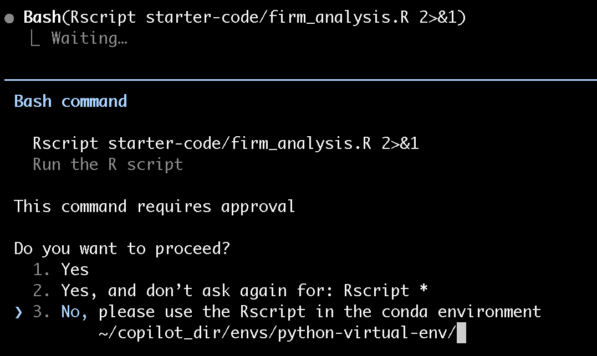
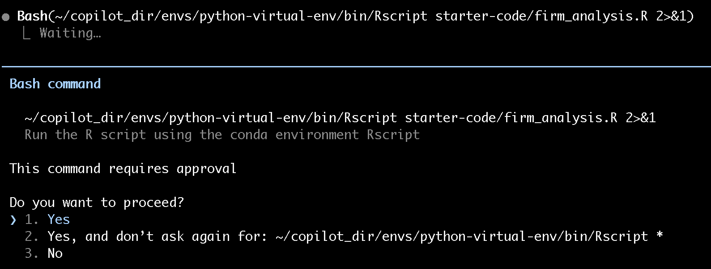
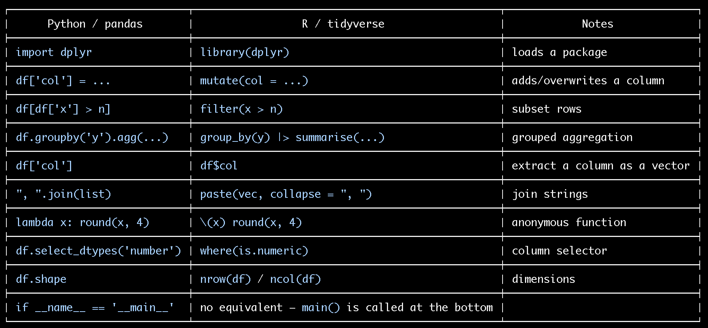

# Part 3, Step 1 – Translate to R

## Telling the AI You're a Beginner (and Why That Helps)

You might be tempted to just say "translate this to R." But if you tell the AI you're not familiar with R, it will:

- Prefer readable, well-named tidyverse idioms over cryptic base-R one-liners
- Add comments explaining what each R construct does
- Be more explicit about package requirements

Always calibrate the output to your level.

---

## Your Prompt

:::{admonition} 💬 Prompt — Translate to R
:class: tip
```
Translate starter-code/firm_analysis.py to R. I am not familiar with R syntax.
Please:
- Use tidyverse idioms (dplyr, readr) rather than base R where possible
- Structure the R code with the same named functions: compute_metrics(),
  filter_firms(), summarize_by_year(), and main()
- Add inline comments explaining any R syntax that would be non-obvious to a
  Python programmer
- Save the output to starter-code/output/summary_r.csv (different filename so
  we can compare to the Python output)
- Add logging using R's message() function for now (we'll improve this later)

Save the file as starter-code/firm_analysis.R
```
:::

:::{note}
The AI should produce an R script similar to:

```r
library(dplyr)
library(readr)

compute_metrics <- function(df) {
  df %>%
    mutate(
      profit = revenue - cost,
      profit_margin = profit / revenue,
      roa = profit / assets,
      asset_turnover = revenue / assets
    )
}

filter_firms <- function(df, min_revenue = 1e6) {
  df %>% filter(revenue > min_revenue)
}

summarize_by_year <- function(df) {
  df %>%
    group_by(year) %>%
    summarise(
      n_firms = n(),
      mean_profit_margin = mean(profit_margin),
      median_profit_margin = median(profit_margin),
      mean_roa = mean(roa),
      mean_asset_turnover = mean(asset_turnover),
      .groups = "drop"
    ) %>%
    mutate(across(where(is.double), ~ round(.x, 4)))
}

main <- function() {
  message("Loading firm data...")
  df <- read_csv("starter-code/data/firms.csv", show_col_types = FALSE)
  message(sprintf("Loaded %d rows", nrow(df)))

  df <- compute_metrics(df)
  df <- filter_firms(df)
  message(sprintf("After filtering: %d rows", nrow(df)))

  summary_df <- summarize_by_year(df)

  output_path <- "starter-code/output/summary_r.csv"
  write_csv(summary_df, output_path)
  message(sprintf("Summary written to %s", output_path))
}

main()
```
:::

---

## Run It

Before running the R script, tell the agent to use the conda R interpreter — just as you did for Python in Part 2:



Claude will ask permission before switching interpreters:



The AI may also offer a summary table mapping Python constructs to their R equivalents:



```bash
Rscript starter-code/firm_analysis.R
```

Then compare the two output files:

```bash
cat starter-code/output/summary.csv
cat starter-code/output/summary_r.csv
```

:::{warning}
The numbers may look the same at a glance, but rounding and floating-point behavior can differ in the 4th decimal place. Don't trust visual inspection — that's what the tests in the next step are for.
:::

---

## Commit

```bash
git add starter-code/firm_analysis.R
git commit -m "feat: add initial R translation of firm_analysis.py"
```

:::{important}
- [ ] `starter-code/firm_analysis.R` exists and runs without errors
- [ ] `starter-code/output/summary_r.csv` is created with 5 rows (one per year)
- [ ] The column names match the Python output
:::

---

**Next: [Step 2 – Write R Tests](step2-tests.md) →**
