# Setup & Orientation

Complete these steps **before the lab starts** if possible. If not, work through them at the beginning of the session.

## Video Walkthrough

:::{iframe} https://kellogg-northwestern.hosted.panopto.com/Panopto/Pages/Embed.aspx?id=914184e8-a672-497d-8431-b45601355701&autoplay=false&offerviewer=true&showtitle=true&showbrand=false&captions=false&interactivity=all
:width: 75%
:align: left
:::

:::{note}
**Using a chat interface instead of a CLI tool?** No setup required. Go to [claude.ai](https://claude.ai) and start a new conversation — no SSH, no cluster access, no software installation needed.

- For **Example: Explore the Data**, sample filing data is embedded directly in each step so you can paste it into chat instead of reading live files on the cluster.
- For **Example: Improve a Script**, paste the contents of `starter-code/edgar_analysis.py` at the start of your conversation when the first step tells you to.

**[Skip to the Introduction →](part1-intro.md)**
:::

---

## Open Two SSH Connections to KLC

You will need **two terminal windows connected to KLC** running simultaneously throughout the lab:

| Terminal | Purpose |
|----------|---------|
| **Terminal A — AI tool** | Runs the AI CLI (`ai_agent_container`) — this process is long-lived and interactive; you leave it running |
| **Terminal B — your work** | Runs everything else: `python starter-code/edgar_analysis.py`, `pytest`, `git log --oneline`, `cat output/insider_summary.csv`, etc. |

Open **both** terminals now and SSH into KLC from each:

```bash
ssh <netid>@klc0402.quest.northwestern.edu
```

Replace `<netid>` with your Northwestern NetID.

:::{tip}
The core pattern throughout this lab: make a change (in Terminal A or a chat window), then switch to Terminal B to run the code and inspect the result before moving on.
:::

---

## Terminal B — Command Line Setup

Do the following steps in **Terminal B**.

### 1. Create Your Working Directory Structure

Create a parent folder that will hold both your virtual environment and your code repositories. This structure is required by the `ai_agent_container` module on KLC.

```bash
mkdir -p ~/krs_summer_lab_2026/envs
mkdir -p ~/krs_summer_lab_2026/repos
```

---

### 2. Clone the Repository

```bash
cd ~/krs_summer_lab_2026/repos
git clone https://github.com/rs-kellogg/krs-summer-2026-lab.git
```

---

### 3. Create Your Two Working Repositories

The cloned repo is the lab guide — your actual code lives in two separate repos, one per track.

:::{important}
**Why two repos?**

This lab has two distinct tracks:

| Repo | Example | Starting state |
|------|---------|---------------|
| **`edgar-scratch`** | Example: Explore the Data | Empty — you write every line of code |
| **`edgar-improve`** | Example: Improve a Script | Pre-loaded with a working-but-messy starter script |

Keeping them separate gives each track its own clean git history and makes it obvious which codebase you are editing at any point.
:::

**Create `edgar-scratch`** — starts completely empty:

```bash
cd ~/krs_summer_lab_2026/repos
git init edgar-scratch
cd edgar-scratch
git commit --allow-empty -m "chore: initial empty commit — from-scratch track"
cd ..
```

**Create `edgar-improve`** — starts with the inherited starter script:

```bash
git init edgar-improve
cd edgar-improve
cp -r ~/krs_summer_lab_2026/repos/krs-summer-2026-lab/starter-code .
git add starter-code
git commit -m "chore: initial commit with EDGAR starter code"
cd ..
```

---

### 4. Create a Mamba Virtual Environment

The AI agent needs a virtual environment it can use when running Python and R code. We create it inside the `envs` folder using Mamba.

First, activate the Mamba base environment on KLC:

```bash
eval "$('/hpc/software/mamba/24.3.0/bin/conda' 'shell.bash' 'hook' 2> /dev/null)"
source "/hpc/software/mamba/24.3.0/etc/profile.d/mamba.sh"
```

Then create the environment with both Python and R:

```bash
mamba create --prefix=~/krs_summer_lab_2026/envs/edgar-env \
    python=3.12 \
    r-base \
    r-tidyverse \
    r-testthat \
    r-xml2 \
    r-purrr \
    r-optparse \
    pandas pytest \
    --yes
```

Activate it:

```bash
conda activate ~/krs_summer_lab_2026/envs/edgar-env
```

Confirm both Python and R are available:

```bash
python --version   # should print Python 3.12.x
Rscript --version  # should print R scripting front-end version ...
```

:::{admonition} Why a single environment for Python and R?
:class: tip
The AI agent runs inside a Singularity container on KLC. The container bind-mounts your active conda environment so that both Python and R packages are available to the agent during the lab. Keeping them in one environment avoids having to switch environments mid-session.
:::

---

### 5. Verify the Starter Script Runs

In `edgar-improve`, confirm the pre-loaded script works before any modifications:

```bash
cd ~/krs_summer_lab_2026/repos/edgar-improve
python starter-code/edgar_analysis.py
# Expected: "done" printed, and starter-code/output/insider_summary.csv created
```

Your `edgar-scratch` repo intentionally has no code yet — that's what the Explore example is for.

---

### 6. Confirm Version Control

Check that both repos have a clean initial commit:

```bash
cd ~/krs_summer_lab_2026/repos/edgar-scratch && git log --oneline
# Expected: one empty initial commit

cd ~/krs_summer_lab_2026/repos/edgar-improve && git log --oneline
# Expected: one commit with starter-code/
```

---

## Terminal A — AI Session

Do the following steps in **Terminal A**.

### 7. Install Your AI Tool

::::{tab-set}

:::{tab-item} Claude Code CLI

See the full [Claude Code install instructions (macOS & Linux)](https://code.claude.com/docs/en/setup#install-claude-code) or run:

```bash
curl -fsSL https://claude.ai/install.sh | bash
```

Verify the install:
```bash
~/.local/bin/claude --version
```
:::

:::{tab-item} GitHub Copilot CLI

See the full [Copilot CLI install instructions (macOS & Linux)](https://docs.github.com/en/copilot/how-tos/copilot-cli/set-up-copilot-cli/install-copilot-cli#installing-with-the-install-script-macos-and-linux) or run:

```bash
curl -fsSL https://gh.io/copilot-install | bash
```

Verify the install:

```bash
~/.local/bin/copilot --version
```

:::{dropdown} Installing GitHub Copilot CLI — screenshot walkthrough
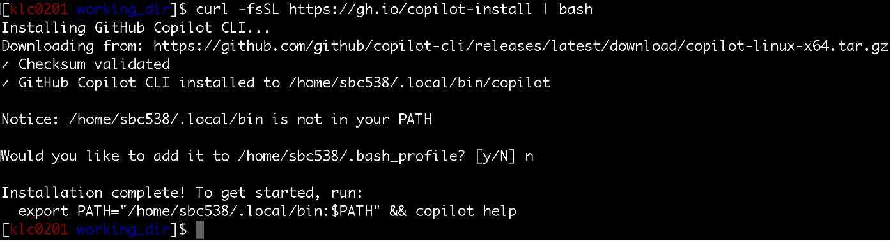
:::
:::

::::

---

### 8. Run the AI Tool on KLC via Singularity

On KLC, AI tools are run inside a **Singularity container** using the `ai_agent_container` module. This gives the agent a sandboxed environment with access to cluster SLURM commands and your project files.

**Load the module:**

```bash
module load ai-agent-container
```

**Change into your `edgar-scratch` repository, then start the agent:**

```bash
cd ~/krs_summer_lab_2026/repos/edgar-scratch
```

```bash
# Claude Code
ai_agent_container -a claude ~/krs_summer_lab_2026/
```

```bash
# GitHub Copilot CLI
ai_agent_container -a copilot ~/krs_summer_lab_2026/
```

:::{dropdown} Additional options — mount extra directories or pass agent arguments
**Mount additional directories** (e.g. a shared data directory — append `:ro` for read-only):

```bash
ai_agent_container -a claude ~/krs_summer_lab_2026/ /path/to/shared/data:ro
```

**Pass arguments directly to the agent** using `--`:

```bash
ai_agent_container -a claude ~/krs_summer_lab_2026/ -- --model claude-opus-4-5
```
:::

:::{note}
`~/krs_summer_lab_2026/` is mounted explicitly so the agent can access the virtual environment in `~/krs_summer_lab_2026/envs/`. This is necessary because Terminal A is a fresh SSH session with no conda activated — the agent cannot auto-detect `$CONDA_PREFIX` here.
:::

:::{dropdown} First-Time Login: Claude Code CLI
The first time you launch Claude Code it will walk you through a browser-based authentication flow. Here is what to expect at each step.

**Step 1 — Trust the folder**

Claude Code first asks whether you trust the current working directory. Select **Yes** to allow it to read and edit files in your project.

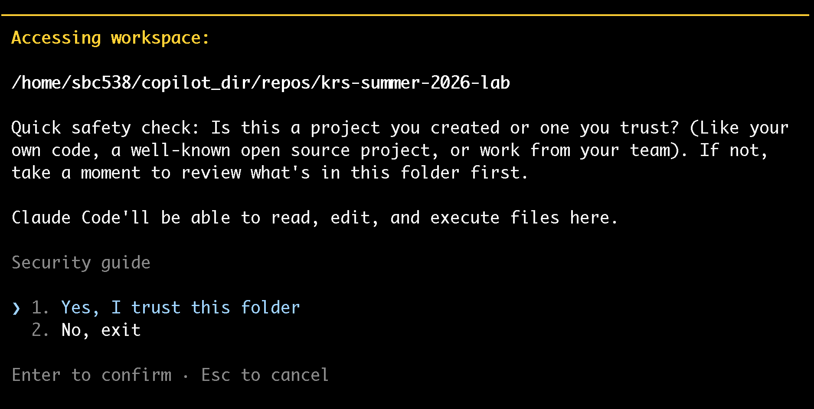

**Step 2 — Claude prompts you to log in**

Claude Code then detects that you have not authenticated and displays a login prompt.

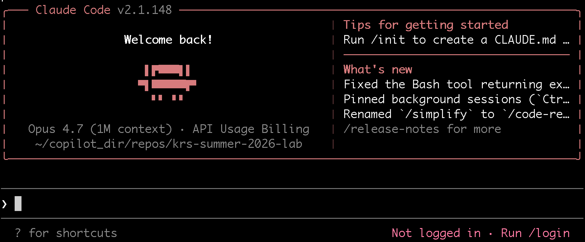

**Step 3 — Run the login directive**

Follow the on-screen instruction to run the login command (or simply press Enter if it offers to do so automatically).


**Step 4 — Copy the URL and open it in your local browser**

Claude Code will print a URL. Copy it and paste it into a browser on your **local machine** (not on the cluster).

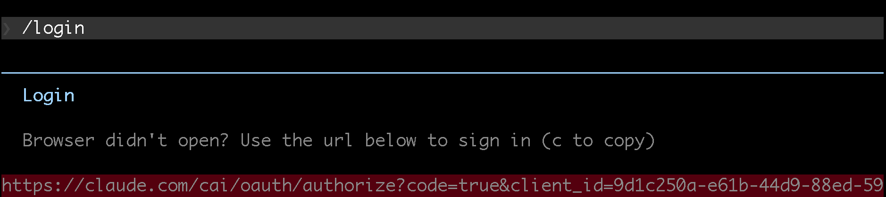

**Step 5 — Copy the authentication code**

The terminal also displays a short one-time code. Copy it — you will paste it into the browser in the next step.

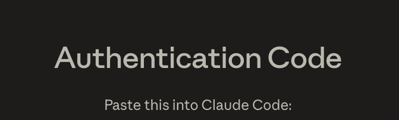

**Step 6 — Select your Claude account in the browser**

In the browser, choose the Claude account that has an active subscription.

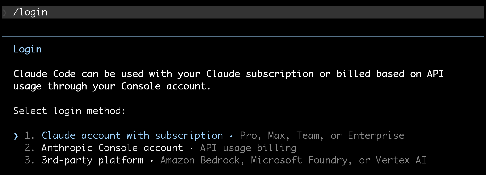

**Step 7 — Paste the code and confirm login success**

Paste the authentication code into the browser prompt. You should see a success confirmation. Return to your terminal — Claude Code will detect the completed login automatically.

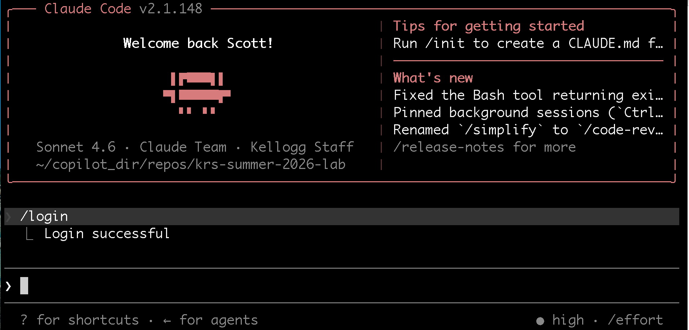
:::

:::{dropdown} First-Time Login: GitHub Copilot CLI
The first time you launch Copilot CLI it will walk you through a browser-based authentication flow. Here is what to expect at each step.

**Step 1 — Run Copilot CLI for the first time**

When you launch Copilot CLI for the first time it detects that you are not authenticated.

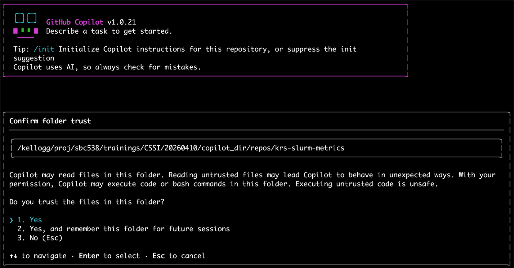

**Step 2 — Select "Login with GitHub"**

Choose the option to log in with your GitHub account.

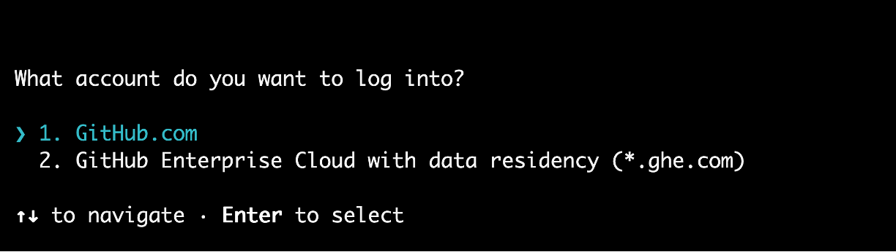

**Step 3 — Go to the URL and copy the one-time code**

Copilot CLI will print a URL and a one-time device code. Open the URL in your **local browser** (not on the cluster) and enter the code shown in your terminal.

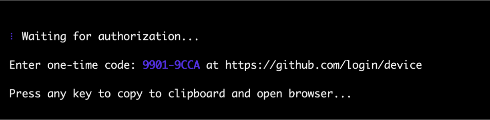

**Step 4 — Login directive**

Follow any remaining on-screen instructions to complete the authentication.

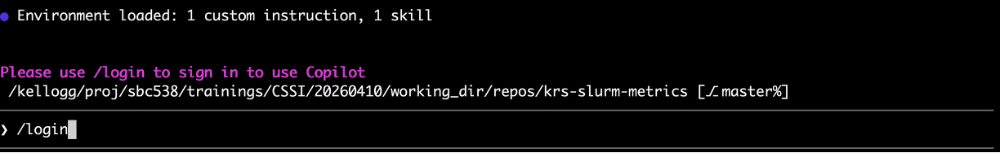

**Step 5 — Stay logged in preference**

You may be asked whether to stay logged in. Select the option that suits your workflow — choosing "No, I will login each time" is the safer option on a shared cluster.

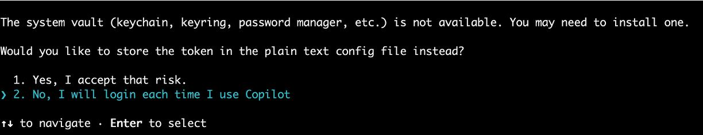
:::

---

:::{important}
Before moving on, confirm you have:

- [ ] You are logged in to KLC via SSH in both terminals
- [ ] `~/krs_summer_lab_2026/repos/edgar-scratch` exists with one empty initial commit (Terminal B)
- [ ] `~/krs_summer_lab_2026/repos/edgar-improve` exists with `starter-code/` inside it (Terminal B)
- [ ] `git log --oneline` in each repo shows the expected initial commit (Terminal B)
- [ ] `~/krs_summer_lab_2026/envs/edgar-env` exists and is active (Terminal B)
- [ ] `python --version` shows 3.12.x and `Rscript --version` works (Terminal B)
- [ ] `edgar-improve/starter-code/output/insider_summary.csv` was created when you ran `edgar_analysis.py` (Terminal B)
- [ ] Your AI tool is installed and running via `ai_agent_container` from `edgar-scratch` (Terminal A)
:::

---

**Next: [Introduction](part1-intro.md) →**

