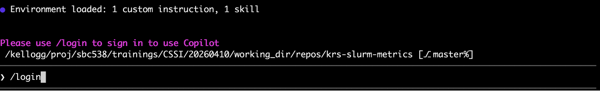

# Setup & Orientation

Complete these steps **before the lab starts** if possible. If not, work through them at the beginning of the session.

---

## 1. Log In to KLC

From your local terminal, SSH into the Kellogg Linux Cluster:

```bash
ssh <netid>@klc0402.quest.northwestern.edu
```

Replace `<netid>` with your Northwestern NetID.

---

## 2. Create Your Working Directory Structure

Create a parent folder that will hold both your virtual environment and your code repositories. This structure is required by the `ai_agent_container` module on KLC.

```bash
mkdir -p ~/copilot_dir/envs
mkdir -p ~/copilot_dir/repos
```

---

## 3. Clone the Repository

```bash
cd ~/copilot_dir/repos
git clone https://github.com/rs-kellogg/krs-summer-2026-lab.git
cd krs-summer-2026-lab
```

---

## 4. Create a Mamba Virtual Environment

The AI agent needs a virtual environment it can use when running Python and R code. We create it inside the `envs` folder using Mamba.

First, activate the Mamba base environment on KLC:

```bash
eval "$('/hpc/software/mamba/24.3.0/bin/conda' 'shell.bash' 'hook' 2> /dev/null)"
source "/hpc/software/mamba/24.3.0/etc/profile.d/mamba.sh"
```

Then create the environment with both Python and R:

```bash
mamba create --prefix=~/copilot_dir/envs/python-virtual-env \
    python=3.12 \
    r-base \
    r-tidyverse \
    r-testthat \
    r-optparse \
    pandas pytest \
    --yes
```

Activate it:

```bash
conda activate ~/copilot_dir/envs/python-virtual-env
```

Confirm both Python and R are available:

```bash
python --version   # should print Python 3.12.x
Rscript --version  # should print R scripting front-end version ...
```

:::{admonition} Why a single environment for Python and R?
:class: tip
The AI agent runs inside a Singularity container on KLC. The container bind-mounts your active conda environment so that both Python and R packages are available to the agent during the lab. Keeping them in one environment avoids having to switch environments mid-session.
:::

---

## 5. Install Your AI Tool

::::{tab-set}

:::{tab-item} Claude Code CLI

See the full [Claude Code install instructions (macOS & Linux)](https://code.claude.com/docs/en/setup#install-claude-code) or run:

```bash
curl -fsSL https://claude.ai/install.sh | bash
```

Verify the install:

```bash
claude --version
```
:::

:::{tab-item} GitHub Copilot CLI

See the full [Copilot CLI install instructions (macOS & Linux)](https://docs.github.com/en/copilot/how-tos/copilot-cli/set-up-copilot-cli/install-copilot-cli#installing-with-the-install-script-macos-and-linux) or run:

```bash
curl -fsSL https://gh.io/copilot-install | bash
```

Verify the install:

```bash
gh copilot --version
```

:::{dropdown} Installing GitHub Copilot CLI — screenshot walkthrough

:::
:::

::::

---

## 6. Run the AI Tool on KLC via Singularity

On KLC, AI tools are run inside a **Singularity container** using the `ai_agent_container` module. This gives the agent a sandboxed environment with access to cluster SLURM commands and your project files.

**Load the module:**

```bash
module load ai-agent-container
```

**Start the agent, passing the directories it needs access to:**

```bash
# Claude Code — give it your project directory
ai_agent_container -a claude ~/copilot_dir/repos/krs-summer-2026-lab
```

```bash
# GitHub Copilot CLI
ai_agent_container -a copilot ~/copilot_dir/repos/krs-summer-2026-lab
```

:::{dropdown} Additional options — mount extra directories or pass agent arguments
**Mount additional directories** (e.g. a shared data directory — append `:ro` for read-only):

```bash
ai_agent_container -a claude ~/copilot_dir/repos/krs-summer-2026-lab /path/to/shared/data:ro
```

**Pass arguments directly to the agent** using `--`:

```bash
ai_agent_container -a claude ~/copilot_dir/repos/krs-summer-2026-lab -- --model claude-opus-4-5
```
:::

:::{note}
The module automatically detects your active conda environment (`$CONDA_PREFIX`) and bind-mounts it into the container, so all packages you installed in Step 4 are available to the agent.
:::

:::{dropdown} First-Time Login: Claude Code CLI
The first time you launch Claude Code it will walk you through a browser-based authentication flow. Here is what to expect at each step.

**Step 1 — Claude prompts you to log in**

When Claude Code starts for the first time it detects that you have not authenticated and displays a login prompt.


**Step 2 — Run the login directive**

Follow the on-screen instruction to run the login command (or simply press Enter if it offers to do so automatically).



**Step 3 — Copy the URL and open it in your local browser**

Claude Code will print a URL. Copy it and paste it into a browser on your **local machine** (not on the cluster).


**Step 4 — Copy the authentication code**

The terminal also displays a short one-time code. Copy it — you will paste it into the browser in the next step.


**Step 5 — Select your Claude account in the browser**

In the browser, choose the Claude account that has an active subscription.


**Step 6 — Paste the code and confirm login success**

Paste the authentication code into the browser prompt. You should see a success confirmation. Return to your terminal — Claude Code will detect the completed login automatically.


**Step 7 — Trust the folder**

Claude Code will ask whether you trust the current working directory. Select **Yes** to allow it to read and edit files in your project.


:::

:::{dropdown} First-Time Login: GitHub Copilot CLI
The first time you launch Copilot CLI it will walk you through a browser-based authentication flow. Here is what to expect at each step.

**Step 1 — Run Copilot CLI for the first time**

When you launch Copilot CLI for the first time it detects that you are not authenticated.


**Step 2 — Select "Login with GitHub"**

Choose the option to log in with your GitHub account.


**Step 3 — Go to the URL and copy the one-time code**

Copilot CLI will print a URL and a one-time device code. Open the URL in your **local browser** (not on the cluster) and enter the code shown in your terminal.


**Step 4 — Login directive**

Follow any remaining on-screen instructions to complete the authentication.


**Step 5 — Stay logged in preference**

You may be asked whether to stay logged in. Select the option that suits your workflow — choosing "No, I will login each time" is the safer option on a shared cluster.


:::

---

## 7. Verify the Starter Script Runs

```bash
python starter-code/firm_analysis.py
# Expected: "done" printed, and starter-code/output/summary.csv created
```

---

## 8. Confirm Version Control

```bash
# You already have git history from cloning — confirm with:
git log --oneline
```

---

:::{important}
Before moving on, confirm you have:

- [ ] You are logged in to KLC via SSH
- [ ] `~/copilot_dir/envs/python-virtual-env` exists and is active
- [ ] `python --version` shows 3.12.x and `Rscript --version` works
- [ ] Your AI tool is installed (`gh copilot --version` or `claude --version`)
- [ ] `starter-code/output/summary.csv` was created when you ran `firm_analysis.py`
- [ ] `git log --oneline` shows at least one commit
:::

---

**Next: [Part 1 · Introduction](part1-intro.md) →**
